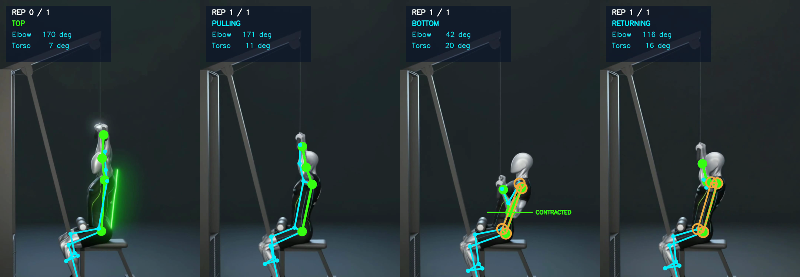

# Real-video verification runs

These are genuine end-to-end runs of the FormFix pipeline — real MediaPipe
Pose Landmarker detection, not synthetic pose tracks — over the three
reference clips that ship with the project.

**They are verification, not evaluation.** The reference clips are 3D-animated
instructional videos: they cut between wide shots, close-ups of a hand on the
bar, and anatomical muscle overlays, and they are not single-take recordings of
a person performing a set. They cannot support an accuracy figure, and none is
claimed here. What they *can* do — and what these runs demonstrate — is show
that the pipeline behaves correctly on real, imperfect, non-ideal footage, and
that it refuses to invent findings when it cannot see the movement.

Reproduce any of them with:

```bash
python scripts/calibrate.py static/assets/videos/lat-pulldown-reference.mp4 pulldown
```

Environment: MediaPipe 0.10.14, NumPy 1.26.4, OpenCV 4.10, Python 3.10, CPU
delegate. Recorded 29 August 2026.

---

## 1. Squat reference — correctly refused

| Measure | Value |
| --- | --- |
| Pose coverage | 84.5% of frames |
| Usable frames (best side) | 83.0% |
| Camera estimate | diagonal, side-view confidence 0.72 |
| Repetitions detected | **0 complete, 7 partial** |
| Outcome | `no_complete_squat` — analysis stopped |

FormFix tracked the figure well (84% coverage) and still produced no technique
feedback, because the clip contains no continuous squat set — it cuts between
angles and inserts close-ups, so seven movements *started* and none was
observed through to completion. Each was recorded as a partial movement with
its reason.

**This is the correct outcome.** A montage is not a set, and the system said so
instead of assembling a verdict out of fragments.

---

## 2. Lat pulldown reference — analysed, with the limits stated

| Measure | Value |
| --- | --- |
| Pose coverage | 62.4% of frames |
| Usable frames | 52.4% |
| Camera estimate | side, side-view confidence 1.00 |
| View stability (IQR of frontality) | **0.62** — the clip changes angle |
| Second person present | 24.6% of frames |
| Repetitions detected | 1 complete, 1 partial (clip ended mid-movement) |
| Recording quality | limited |

Per-repetition measurements:

| Rep | Top elbow | Bottom elbow | ROM | Torso excursion | Wrist travel | Valid frames |
| --- | --- | --- | --- | --- | --- | --- |
| 1 | 177° | 42° | 135° | 18.9° | 0.68 | 95% |

Rule verdicts:

| Rule | Verdict | Reliability | Evidence |
| --- | --- | --- | --- |
| `pulldown_rom` | **PASS** | medium | 177° top / 42° bottom against criteria of ≥150° and ≤100° |
| `pulldown_torso` | **WARNING** | medium | 18.9° excursion vs a 15° tolerance, sustained over **21 of 49** frames of the pull (43%) |



*The annotated output of this run. Left to right: the extended top position
(elbow 170°, trunk 7°), the pull (171° → closing), the contracted position
(42°, trunk 20°) with the `CONTRACTED` marker through the elbow, and the
return (116°, 16°). The analysed arm chain is emphasised in Neon Lime, the
rest of the skeleton in Electric Cyan, and the amber rings on the shoulder and
hip mark the landmarks the torso finding was measured from — only those, so
the viewer can see exactly which measurement produced the banner.*

The torso finding is fully traceable: mid-shoulder and mid-hip landmarks →
signed trunk inclination → change from this athlete's own top-position
baseline → 18.9° peak → held for 43% of the pulling phase → above the 15°
configured tolerance → warning, reported at *medium* reliability because the
recording was already flagged as limited.

The three warnings the run raised — a second person, intermittent tracking, and
a changing camera angle — are all true of the clip.

---

## 3. Shoulder press reference — correctly refused

| Measure | Value |
| --- | --- |
| Pose coverage | 55.0% of frames |
| Usable frames (best side) | **33.8%** |
| Camera estimate | side, frontality 0.19 |
| View stability | 0.47 — the clip changes angle |
| Outcome | `important_landmarks_missing` — analysis stopped |

Roughly half the clip is anatomical close-ups with no arms in shot, so the
shoulder/elbow/wrist chain was measurable in only a third of the frames —
below the configured floor. The run also correctly identified the sections it
*could* see as side-on and noted that a front view is needed for the two
bilateral checks.

**This is the correct outcome**, and it is the honest one: a third of a clip is
not enough to judge someone's technique.

---

## Three implementation defects these runs found

Real footage exercised paths the synthetic tests did not. Both were fixed and
covered by regression tests.

**1. The overlay contradicted the analysis.** The annotated video gated the
skeleton on MediaPipe's raw detection flag, while the analysis used landmarks
restored by short-gap interpolation. On 21 frames of the 710-frame pulldown
clip, the HUD displayed a live elbow angle with no skeleton beneath it. The
overlay now draws whenever usable landmarks exist —
`tests/test_annotation_output.py::TestOverlayShowsWhatTheAnalysisUsed`.

**2. The phase caption could contradict the repetition.** The state machine
labels frames as it goes, so a movement that started, was abandoned as
partial, and was followed by a real repetition left its own labels inside the
successful one's span — the overlay showed `RETURNING` at the start of a
repetition. The rules were unaffected (they read the segmentation, not the
frame track), but the video contradicted the analysis. Inside a committed
repetition the caption now comes from that repetition's own segmentation, in
all three exercises —
`tests/test_annotation_output.py::TestPhaseCaptionMatchesTheRepetition`.

**3. The pulldown's range check required both arms.** Range of motion is a
single-arm joint angle, but the reliability gate demanded that *both* arms be
usable for at least half the repetition. In a side view — the camera position
this exercise explicitly asks for — the far arm is hidden behind the near one
for much of the pull, so the check reported "not assessed" on a well-recorded
side view. It now requires the analysed arm only; both-arm availability is
still recorded for the export. The same over-strict gating was found and fixed
in the press's alignment check, which judges each side independently and
therefore needs only one visible arm.

A fourth, found while setting these runs up: a caller-supplied output
directory that did not exist made `cv2.VideoWriter` silently discard every
frame, so the render "succeeded" and produced nothing. The directory is now
created, and a writer that cannot open raises instead of doing nothing —
`tests/test_annotation_output.py::TestWriterGuards`.

Before the fix the pulldown run reported `pulldown_rom: NOT_EVALUABLE`; after
it, `PASS` with the measurements above. That is a two-line change in a
reliability gate that decided whether a whole check existed — the kind of thing
only real footage surfaces.

---

## What still has to be recorded

None of the above validates a *threshold*. For that, follow `README.md` in this
folder: nine labelled clips, one deliberate fault each, filmed in the camera
view each exercise requires, then `scripts/evaluate_videos.py`.
